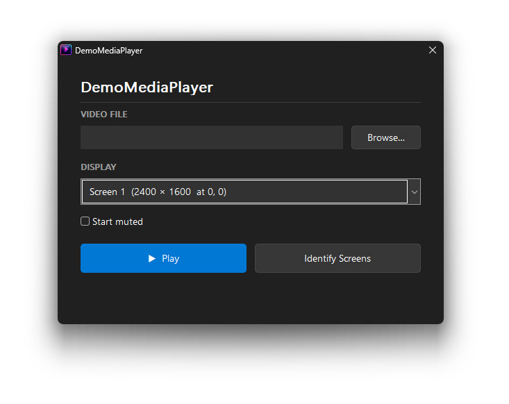

#  DemoMediaPlayer — Murphy-proof your live demos

A minimal fullscreen media player for Windows, built with **C**, **libmpv**, and the **Win32 API**.  
Cross-compiled from Linux using Docker + mingw-w64.



---

## Features

- **No visual player controls:** just the video, no progress bar or buttons that show up ( You can control the player with the keyboard to present at your own pace)
- **Setup dialog:** choose a video file and target display at launch
- **Identify screens:** overlay big monitor numbers on every display for 5 seconds
- **Command-line mode:** skip the dialog and go straight to fullscreen
- **True fullscreen:** borderless, topmost window with hidden cursor
- **Hardware acceleration:** automatic hardware decoding (`hwdec=auto`)
- **Keyboard controls:**

| Key         | Action                  |
|-------------|-------------------------|
| **ESC**     | Quit                    |
| **S**       | Restart from beginning  |
| **P** / **Space** | Toggle pause      |
| **R**       | Seek back 30 seconds    |
| **F**       | Seek forward 30 seconds |
| **Left**    | Seek back 5 seconds     |
| **Right**   | Seek forward 5 seconds  |
| **Up**      | Speed +10% (max 300%)   |
| **Down**    | Speed -10% (min 50%)    |
| **0** / **Enter** | Speed reset to 100% |
| **M**       | Toggle mute              |

---

## Building

### Prerequisites

- **Docker** (Docker Desktop on Windows, or Docker Engine on Linux/macOS)
- Docker BuildKit (enabled by default since Docker 23.0)

### Quick Build

```bash
# Linux / macOS
chmod +x build.sh
./build.sh

# Windows (PowerShell)
.\build.ps1
```

### Manual Docker Command

```bash
docker build --target dist --output type=local,dest=./dist .
```

The build will:
1. Spin up an Ubuntu 24.04 container with mingw-w64
2. Download the latest mpv development files from GitHub
3. Cross-compile `mediaplayer.exe`
4. Export `mediaplayer.exe` + `libmpv-2.dll` into `./dist/`

### Build Options

```bash
# Pin a specific mpv-dev download URL
docker build \
  --build-arg MPV_DEV_URL="https://github.com/shinchiro/mpv-winbuild-cmake/releases/download/..." \
  --target dist --output type=local,dest=./dist .

# Rebuild from scratch (no cache)
docker build --no-cache --target dist --output type=local,dest=./dist .
```

---

## Usage

### Interactive Mode (default)

```
mediaplayer.exe
```

Opens a setup dialog where you can:
- Browse for a media file
- Select which display to use for fullscreen playback
- Click **Identify Screens** to flash a large number on every monitor for 5 seconds — click a screen to select it (the combo box updates automatically) or wait for the overlays to vanish
- Click **Play** (or press Enter) to start

### Command-Line Mode

```
mediaplayer.exe --file "C:\Videos\movie.mp4"
mediaplayer.exe --file "video.mp4" --screen 2
mediaplayer.exe -f "video.mp4" -s 1 -m
mediaplayer.exe -f "video.mp4" -p 30
mediaplayer.exe -h
```

| Option                  | Description                                  |
|-------------------------|----------------------------------------------|
| `--file` / `-f`        | Path to the media file                       |
| `--screen` / `-s`      | Screen number (1-based, default: 1)          |
| `--mute` / `-m`        | Start playback muted                         |
| `--position` / `-p`    | Start at position N seconds (e.g. `-p 10`)   |
| `--help` / `-h`        | Show help in a window                        |

A bare trailing argument is also treated as the file path:

```
mediaplayer.exe "C:\Videos\movie.mp4"
```

When `--file` is provided the setup dialog is skipped and playback starts
immediately in fullscreen on the specified screen (default: screen 1).

The `--mute` flag pre-checks the "Start muted" checkbox in the setup dialog,
or mutes immediately in CLI mode. The `--position` flag is CLI-only and
seeks to the given time in seconds once playback begins.

---

## Runtime Requirements

- **Windows 7 or later** (x86_64)
- `libmpv-2.dll` must be in the **same directory** as `mediaplayer.exe`

No other dependencies are required — codecs, demuxers, and hardware
decoding support are all compiled into `libmpv-2.dll`.

---

## Architecture Notes

| Component | Purpose |
|-----------|---------|
| `main.c` | Single-file C implementation (~350 lines) |
| **Win32 API** | Setup dialog, fullscreen window, message loop |
| **libmpv** | All media playback, decoding, rendering |
| **Dockerfile** | Ubuntu 24.04 + mingw-w64 cross-compilation |

The design intentionally avoids any UI framework (Qt, GTK, etc.).  
The setup dialog is built from raw Win32 controls (`CreateWindowExW`),
and the player window is a plain `WS_POPUP | WS_EX_TOPMOST` surface
that libmpv renders into via the `wid` embedding option.

mpv's event loop is integrated with the Win32 message loop through
`mpv_set_wakeup_callback`, which posts a custom `WM_USER` message
whenever mpv has events to process.

---


